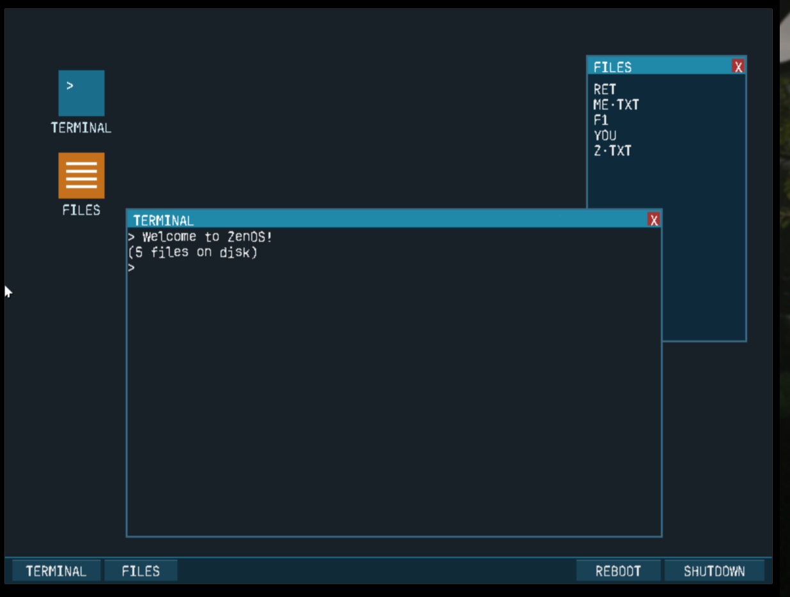

# ZenOS

A tiny x86 (32-bit) hobby operating system with a graphical desktop: draggable
windows, a scrollable terminal, a file explorer, an absolute-pointer mouse and
ACPI power control — booting from a 1.44 MB floppy image.



## Requirements

| Tool                                   | Used for                          |
| -------------------------------------- | --------------------------------- |
| `qemu-system-i386`                     | running the OS (`make run`)       |
| `i386-elf-gcc`, `i386-elf-ld`          | cross-compiling the kernel        |
| `nasm`                                 | bootloader / asm sources          |
| GNU `make`                             | build orchestration               |
| `dd`, `truncate` (coreutils)           | disk image assembly               |
| `gdb` (optional)                       | `make debug`                      |

Notes:
- Any Linux distro works out of the box; on macOS/Windows use WSL or a cross
  toolchain built with `--target=i386-elf`.
- The `i386-elf` toolchain can be built from binutils + gcc sources or grabbed
  prebuilt (e.g. from your package manager as `i386-elf-gcc` /
  `gcc-i686-elf-cross-binutils`).

## Build & run

```
make clean
make run
```

This builds the bootloader, kernel and user program, packs them into a
bootable 1.44 MB floppy image (`os-image.bin`) plus a data disk (`disk.img`),
and boots it in QEMU.

Other targets:

```
make debug   # start QEMU with a gdb stub on :1234
make runc    # rebuild from clean
```

## Features

- **Desktop GUI** — 800×600 VBE framebuffer, wallpaper, icons and a taskbar
  (Terminal / Files / Reboot / Shutdown).
- **Draggable windows** — grab any title bar to move windows around the
  desktop.
- **Absolute mouse** — uses the VMware `vmmouse` backdoor, so the guest cursor
  mirrors the host pointer one-to-one under QEMU; falls back to a hand-rolled
  PS/2 + Intellimouse driver (with wheel support) on real hardware.
- **Scrollable terminal** — the shell renders into a window with a 64-line
  scrollback ring; scroll the mouse wheel to browse history in both
  directions, typing snaps back to the bottom.
- **File explorer** — lists files from the data disk image; clicking a file
  dumps its contents into the terminal.
- **Power control** — ACPI shutdown (QEMU exits cleanly) and reboot from the
  taskbar.
- **Under the hood** — custom bootloader (VBE mode set), GDT/IDT/PIC, PS/2
  keyboard, timer-driven round-robin scheduler with ring-3 user programs,
  minimal libc, and a serial port console for debugging.

## Shell basics

The terminal is a simple shell. Try `help`, `ls`, `echo hi` and `clear`.

## Repository layout

```
boot/      bootloader + kernel entry
kernel/    kernel main, shell
cpu/       GDT, IDT, interrupts, tasks
drivers/   framebuffer, gui, keyboard, mouse, vmmouse, disk, serial, power
libc/      string/mem/stdio helpers
user/      sample ring-3 user program
```
